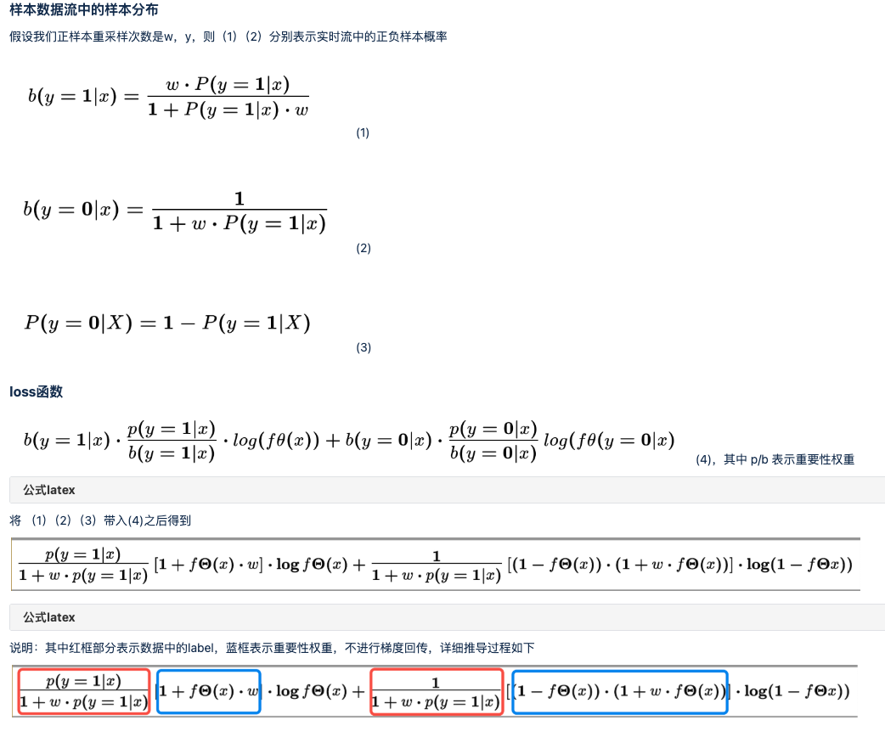
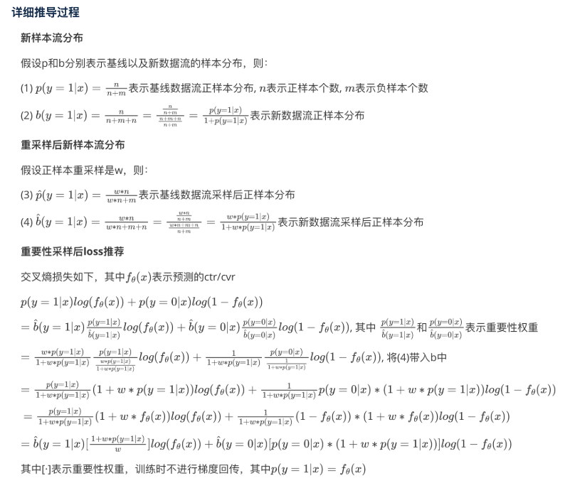

# Online learning

## 问题描述:

广告或者推荐业务中，排序的目标会有多个。其中有些目标样本回流的速度会比较慢，如果一直等待所有目标都完成行为回流之后再训练这条样本，可能会导致比较久的模型更新延迟。

## 收益预期：

推荐系统希望能够更快的利用线上数据。这样可以更好的拟合线上数据的分布变化。如果短时间内线上数据分布的变化越显著，则online learning的效果越显著。影响这个更新速度的地方有两个，一个是样本回流的速度，另一个是模型训练更新的速度。

## 方案：

这个方向的大部分方案其实是来自在线广告领域。Online learning是需要同时解决这两个点的问题，不过相对来说更多的精力其实是会放在如何解决样本回流速度的问题。广告领域主要解决的的CVR回流延迟的问题。

### 模型侧的改动:

#### FNW loss

FNW loss是先把样本当做负样本训练，等正向行为产生之后再用这条正样本进行训练。但是这样做会使得模型训练样本的分布和真实分布存在偏差。因此该方案在loss函数中通过重要性采样的方式来进行修正。相关推导在论文3.2.3节有详细介绍，并且证明了该方案可以使得最终的预测ctr和真实ctr更加接近，

该方案在推荐场景应用存在两个问题:

1）推荐领域会存在多个目标，广告领域FNW loss只需要考虑CVR一个目标。以直播场景为例，通常的目标会包含进房目标，观看时长目标，送礼目标，关注目标，上麦目标等。对于进房目标来说反馈比较迅速，但是对于送礼和观看时长目标可能需要等待的时间比较久，对于关注目标可能是用户离房时候才会产生。也就是说，推荐场景的多个目标各自的延迟时间并不一致。

2）推荐领域会存在对于不同目标的正样本设置额外的loss权重的问题。尤其是对于时长目标来说loss的权重设置可能会比较复杂。针对这种情况FNW loss的重要性采样修正方案需要做重新推导。

针对loss加权问题的FNW loss的推导：





针对多个目标正样本反馈时间不同的问题：

1、目前模型基本都会采用mmoe这种形式来缓解多目标之间的互相干扰问题。除此之外还可以考虑在对样本的目标回传做调整。例如当送礼目标正向行为出现时候，该条样本的其他目标会设置为负样本。其他目标负样本的loss不会进行回传。

#### ES-DFM

该方案对比FNW主要有两处改动：

1、重要性采样的概率修正使用延迟预测模型的预测值。

2、在短时ctr目标反馈之后，设置一个观察时间窗口，对于窗口内返回的样本正常训练。对于窗口外返回的样本先按照负样本训练，等正反馈到来之后再训练一次，同时使用重要性采样对loss进行修正。

对比FNW的两个优点是 （1）同时设置CVR的等待时间窗，减少了伪负样本的数量。在时效性和样本偏差之间做了平衡。（2）使用模型预估值计算重要性采样的权重，减少了方差和偏差。

#### 模型训练和更新的方案:

### 离线效果评估：

1、用户行为数据变化分布。可以考虑对比不同人群相邻小时的行为率值的变化，对比每周同时段用户行为率值的变化。看用户的行为分布变化是否比较快。但是这个变化比例需要依赖个人评估，并不好作为准确的衡量指标。

2、模型离线效果评估

```
判断是否存在online learning优化的空间:

    对比T时刻基线模型，预测T+1时刻和T+N时刻样本的AUC差异。

   判定online learning模型的效果：

    假设线上系统的模型更新延迟是4小时。则可以对比online learning方案训练的T-1时刻的模型预测T时刻样本的AUC，以及基线方案训练的T-5时刻模型预测T时刻样本的AUC。
```

## 存在的问题：

1、FNW loss是通过重要性采样对样本分布进行了修正，但是这要求样本的正样本率比较低才行。

2、如果系统本身延迟不是特别久，例如延迟只有一两个小时，那么进一步提升至15分钟以内，或者到分钟级更新的收益并不会特别大，往往效果都比较持平。

### 参考论文：

Addressing Delayed Feedback for Continuous Training with Neural Networks in CTR prediction

Capturing Delayed Feedback in Conversion Rate Prediction via Elapsed-Time Sampling
