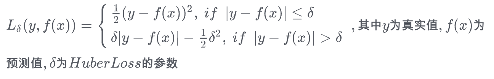
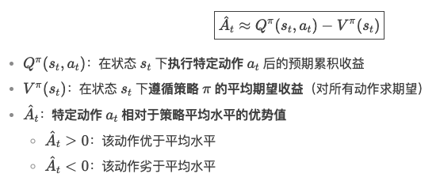
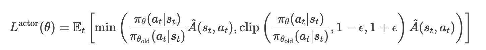
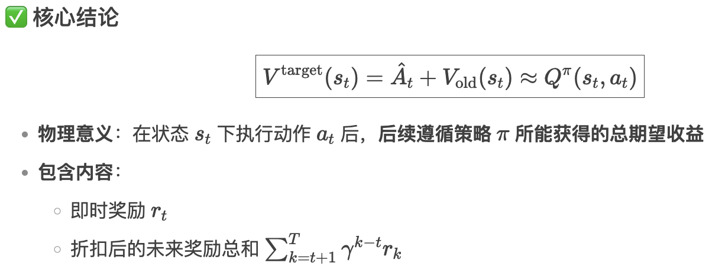
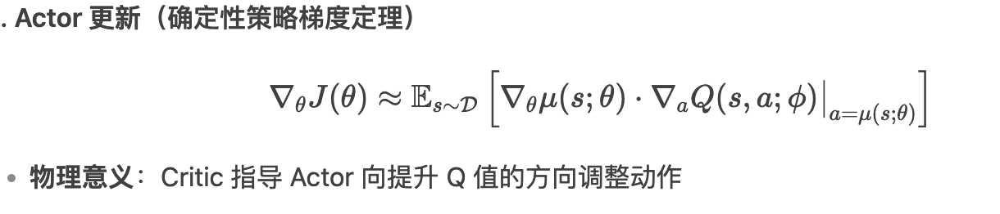
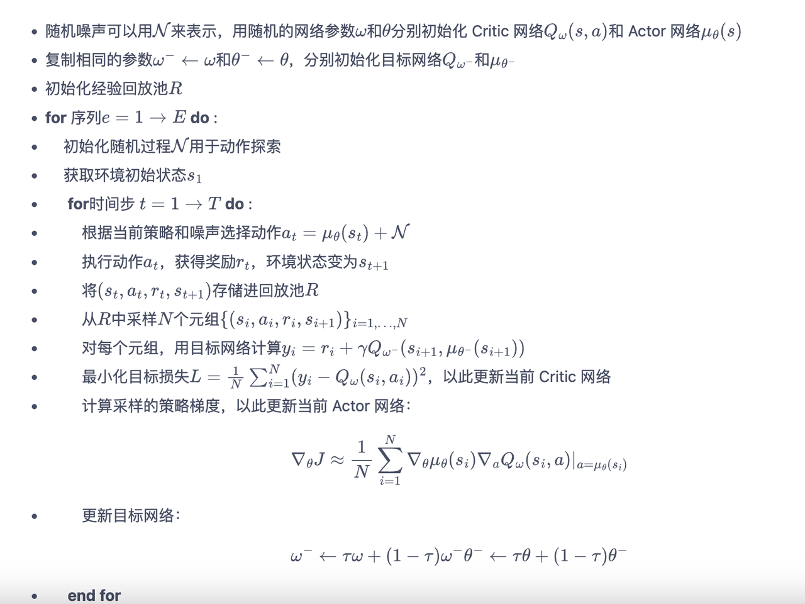
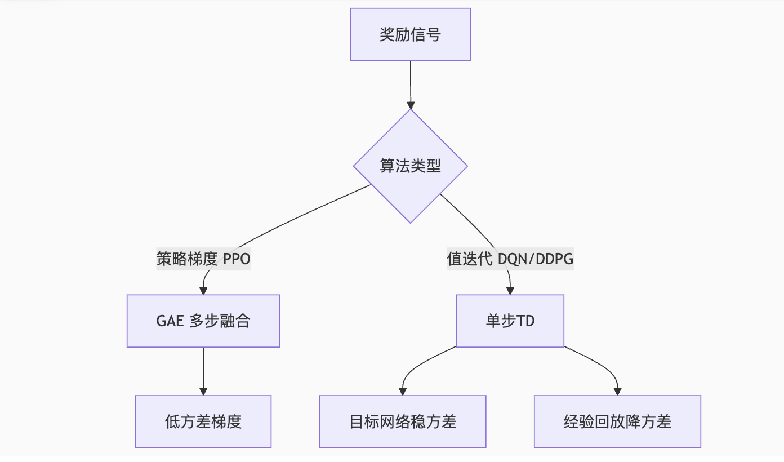
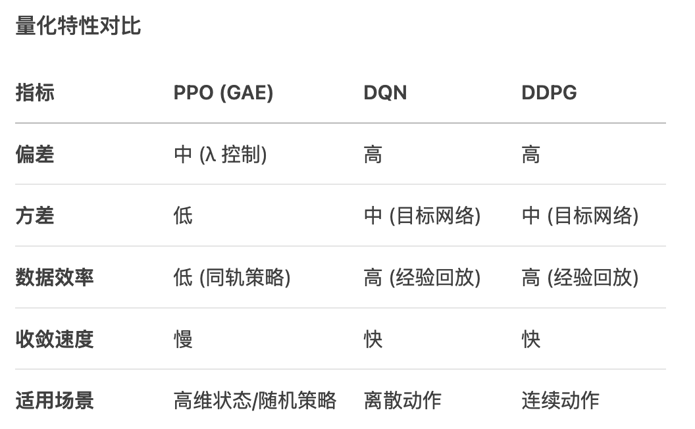

## DQN

### 算法概述：

DQN对比Q-learning就是通过神经网络来根据状态和action来预测对应的reward。

#### reward计算：

reward是计算在当前状态s下采取动作a后能获得的期望回报。

if done:

```
y = r  # 如果下一个状态是终止状态，未来累积奖励就是当前的即时奖励 r
```

else:

```
y = r + γ \* max\_a' Q\_target(s', a')  # 否则，目标值是当前奖励 r 加上折扣后的最大未来 Q 值估计。
```

但是reward的范围可能会比较大，另外使用mse loss也是假定数据服从正态分布。可以采用cox-box变换等方式对reward进行缩放处理。也可以对reward设置上下限的阈值进行缩放。

#### loss函数：

DQN的loss函数是预测值和记录的y值（ r + γ \* max\_a' Q\_target(s', a')）尽可能接近，所以会选择mse loss。

但是对于回归目标来说也可以选择 huber loss



#### 样本回放：

DQN是一个离线策略。样本回放正是这一点的体现。样本回放是指在一定阶段通过存储转移元组`(state, action, reward, next_state, done)` 将这些样本保存下来。在训练阶段会通过从样本池中随机采样的方式获取一个batch的样本。这样获取的样本可以认为每一条都是独立同分布的样本。神经网络训练使用的随机梯度下降也是假设使用的训练样本之间是独立同分布的。

#### 如何保证探索：

DQN的探索机制通过ε-Greedy 策略来实现。也就是说每次选择action的时候有ε的概率随机选择一个动作。

#### 目标网络的意义:

从loss函数可以看到 在计算loss的时候也是需要Q网络来计算当前状态+action对应的预期收益。目标网络的作用就是要解决训练不稳定的问题。训练过程中目标网络会先固定，用于计算Q值。经过一定的训练步数之后会将在线网络的参数更新到目标网络中。

## PPO：

#### 算法概述：

PPO是一个online policy的策略方案，PPO算法作为一个梯度策略算法也是 actor-critic的结构。其中actor model负责输出action的概率分布，critic model负责预估在当前状态下的期望收益，最终我们线上使用的是actor model。

PPO既可以处理连续型动作空间，也可以处理离散型动作空间。对于连续性动作空间来说可以将动作参数看做一个高斯分布，PPO actor model输出均值和方差，对于离散型动作空间直接输出各个action的概率分布。

#### Critic model:

输入是环境状态，输出是预测的目标价值，输出值应该是一个标量，含义是在当前环境下的期望收益。

这个期望收益的计算方式有 蒙特卡洛方案，时序差分，GAE广义优势估计。其中广义优势估计是使用最多的方案。

#### GAE:

广义优势估计可以看做是:每一步时序差分计算结果的指数衰减之后加和的结果。

广义优势估计的数学本质:



#### loss函数:

Actor model loss：

目标函数 = 广义优势估计\*新actor model的概率/旧actor model的概率。需要最大化这个目标函数

直观的理解就是如果At值是正数，则增大对于这个action的预测概率，如果是负数则减少这个action的预测概率。



Critic model loss:

Critic model 的目标是让预测值更加接近目标值，所以critic model可以使用mse loss或者其他的优化变体。

那重点就是这个目标值是啥。critic model的目标值是：



Critic model的输入是当前状态state，Vold(st) 是指线上交互产生样本时候的预测值。这个目标值采用Q值的原因，就是因为这样使用mse loss训练得到的才是state对应的期望。

## DDPG

DDPG算法和DQN一样也是off policy的算法。可以离线多次重复利用收集的样本。DDPG主要解决DQN无法处理连续动作空间的问题。

DDPG分为 actor model和critic model。

#### Critic model:

输入：状态 `s` + 动作 `a`

输出：状态-动作价值 `Q(s,a)`，计算方式

loss函数

软更新：

#### Actor model：



#### 算法流程：



如何保证探索：输出动作增加随机扰动

#### DDPG存在的问题：

Actor model的更新需要使用Q值，但是Q值的范围和方差会极大的影响actor model的梯度。

实际可以使用TD3和SAC。

DQN和DDPG都是一步差分来计算目标值。

三种算法的对比：




