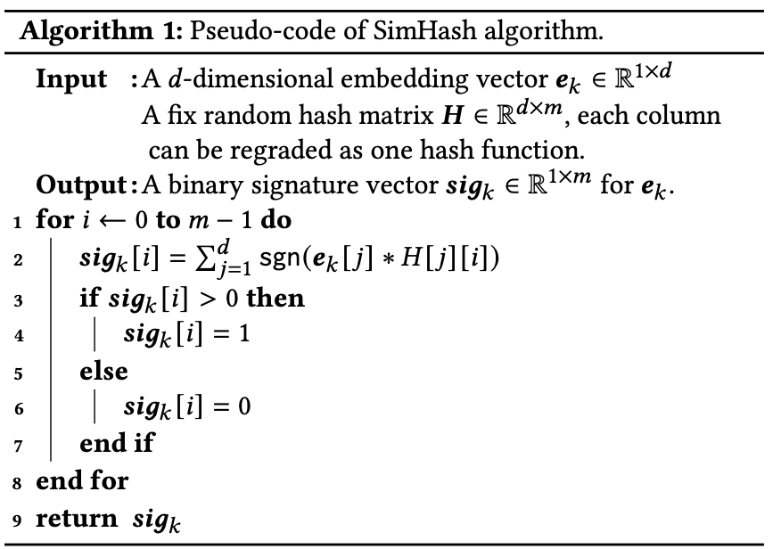

## 业务问题定义：

如何利用用户更长周期的行为数据。一方面可以使用户行为更加丰富，另一方面也可以包含用户更长期的行为，从而活动更加稳定全面的用户兴趣表示。

## 要解决的问题：

### 长序列检索：

这个是指使用用户更长周期的序列时候如何快速检索出和当前候选item相似的内容。需要考虑的问题包括用户长序列的线上存储，在线实时更新，长序列检索的效率。检索出来的相似度计算和模型中相似度计算的差异。

### 模型使用：

长序列检索到的item可以作为用户长期兴趣偏好。这些item如何在模型中使用？

## 解决方案：

### 长序列检索:

1、可以按照SIM的hard search和soft search进行分类。其中hard search比较简单直接利用item的类别进行划分。soft search后续一系列论文迭代比较多。

**ETA**​**​ SimHash :**

ETA论文中 通过simhash的方式将embedding进行压缩从而得到一个更短的item embedding表示。对于这个压缩后的embedding可以通过汉明距离来计算相似度。这里有个疑问是为啥不使用HNSW 。主要原因是使用HNSW需要对当前的整个序列构建检索图。HNSW的空间复杂度较高nlogn，并且更新操作的复杂度也是logN。对比之下 LSH更加适合快速更新和节省线上存储空间。

simhash的实现方式如下:

Rankd hash矩阵每一行的这个向量作为一个随机has函数。向量内积的含义是两个向量的模相乘，然后乘以夹角余弦。这样也要求item embedding的分布要比较分散。

SDIM:

使用hash函数将用户序列分成了多个分桶，候选item取对应桶中的item做pooling之后作为用户的兴趣表示。

假设使用10个hash函数，LSH计算之后原来的item embedding分成了10维，假设我们使用两个hash函数的结果作为分桶签名，则可以分成5个桶。

候选item也会经过这10个hash函数，然后找会落到哪些hash桶中，然后取对应桶中的item的embeding做pooling操作。

TWIN：

twin的主要目的是减少长短序列计算 候选item和序列item相似度不一致的问题。因此对于长序列的相似度计算也尽可能使用短序列attention 的计算参数。但是这么做会带来比较高的计算复杂度，因此论文提出了一些简化计算的方案。先分析target attention 计算的复杂度主要的复杂度其实是来自item特征的投影计算，也就是把item的固有属性特征的embedding和user->item交叉特征的embedding计算投影，这部分的可以在离线预先计算。这样线上计算复杂度会大大降低。

衡量一致性的指标就是ESU和GSU计算出来的topK的一致性。

TWINV2：

该方案主要是为了进一步延长TWIN的长序列处理能力。采用的方式是对于用户序列进行分割和压缩。分割是指对不同用户行为分割成不同的序列。采用kmeans层次聚类的方案将序列聚类之后之后得到一个更短的序列表征。新序列的每个虚拟item就是聚类的一个点。

但是存在的问题是这样聚类之后如何对聚类的embedding进行更新。这样使用更长的序列是否有必要呢？聚类本身不也会带来信息的损失吗？

### 如何进行更新和联合训练。

**SIM: ​** SIM的hard search并不需要联合训练，通过商品类别检索出来top100item之后可以把item id的序列作为特征收入模型。线上rtp预测阶段根据item id取对应的item特征的embedding，然后类似ESU的处理方案

**ETA: ​**ETA也是将选取到的topK相似item输入模型，存在的问题是如何更新GSU阶段的检索使用的embedding hash结果。论文中并没有给出具体的更新方式，可能得方式是随着模型的embedding更新，对应item的新embedding再重新计算hash值

**TWIN:**

在模型更新的时候需要对item特征使用 target attention对于key的映射矩阵提前计算。也是当模型更新的时候对item对应的特征同步更新对应的映射结果。

​**ESU**​：

Multi-Head Target Attention.

### 是否要加辅助loss:

通过辅助loss增强长序列对于当前候选item的判断力。
